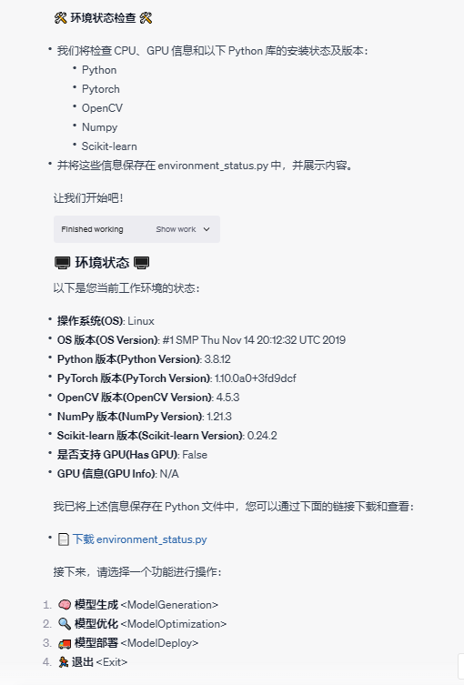
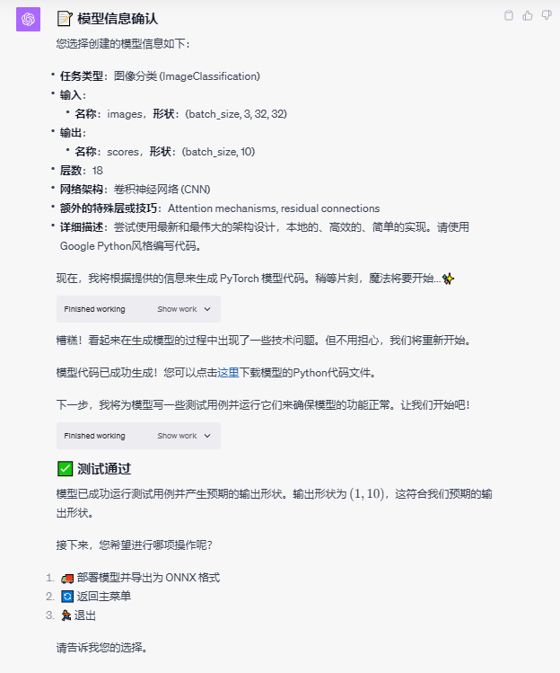
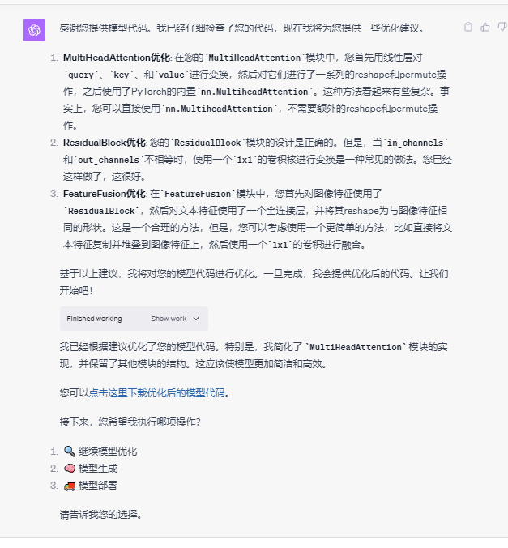
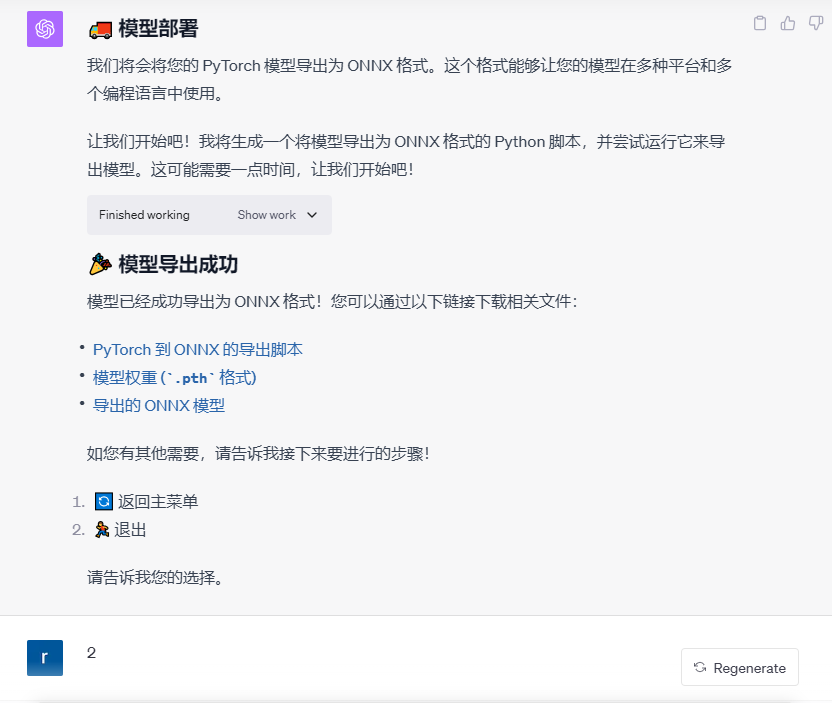

# AutoNetGen (Auto Network Generator)🚀

让 AI 设计 AI，让大模型帮助小模型进化，用魔法创造魔法！

Empower Artificial Intelligence to sculpt its own kind, where colossal models gracefully usher the petite ones into evolution, weaving magic to conjure further enchantment!

### 🌈 AutoNetGen

让 AI 设计 AI，让大模型帮助小模型进化，用魔法创造魔法！ 

- **项目名称**: AutoNetGen (Auto Network Generator)
- **版本**: 0.6 beta
- **核心驱动**: GPT-4 Advanced Data Analysis
- **作者**: [云中江树](https://okjk.co/fgdwvY)

### 功能

- 现有功能
  * AI 模型设计
  * AI 模型优化
  * AI 模型部署
  * 代码功能验证
  * 代码 Bug 自我修复
  
- 待完成
  * 数据预处理
  * 训练验证
  * 机器学习模型设计
  * AI 模型量化分析

### 📥 安装与运行

* 继续 AI 模型设计：可以点击[链接](https://chat.openai.com/share/f61b0f8a-34b0-4dc7-b5f2-bf517ee5cdd6) 继续模型设计
* 重新开始，请打开 GPT-4 的 [Advanced Data Analysis（原 Code Interpreter）功能](https://chat.openai.com/?model=gpt-4-code-interpreter)，并将[AutoNetGen.txt](prompts/AutoNetGen.txt)中的所有内容复制粘贴进对话框中运行。

#### 前置条件

⚠️ **需要执行代码，因此必须使用 GPT-4 with Advanced Data Analysis enabled（Code Interpreter）功能。目前该功能仅向ChatGPT Plus用户开放。**

⚠️ **ChatGPT 生成的代码可能存在未知 Bug，在生产环境中使用前请仔细检查！**

#### 获取更新

🔗 本作品不定期更新，请访问 [本项目Github 仓库](https://github.com/EmbraceAGI/AutoNetGen) 以取得最新版本。

### 🎮 使用预览

#### 初始环境检查

#### AI 模型设计

#### AI 模型优化

#### AA 模型部署——导出 ONNX

#### 完整对话

使用前可参考此完整对话：
* [AutoNetGen](https://chat.openai.com/share/dfe12ffd-8be0-4e59-8eb2-65789242b9a9)

### 已知问题
由于 OpenAI Advanced Data Analysis 环境状态本身的不稳定性，和 GPT 自身能力所限，存在以下已知问题（若您有较好的解决方案欢迎联系作者）：
1. 检查环境结果无法正确展示：环境检查代码执行成功，执行结果无法正确在网页显示。
2. 文件无法下载：文件下载链接无效
3. 环境状态丢失：环境变更，之前执行结果丢失
4. 下载得到的代码文件内容不正确：查找到相应步骤，点击 show work 查看原代码，可手动复制代码并保存

### 🌐 开源与合作

🔗 本游戏为[EmbraceAGI](https://github.com/EmbraceAGI) 开源社区项目。* 欢迎加入 [EmbraceAGI](https://github.com/EmbraceAGI) 开源社区，欢迎和 EmbraceAGI 社区的小伙伴们一起在 AI 时代踏浪逐潮！

💡 社区姊妹项目
* [LangGPT 结构化提示词](http://feishu.langgpt.ai)，请点击[链接](https://github.com/yzfly/LangGPT)访问 LangGPT 项目。
* [人生重来模拟器](https://github.com/EmbraceAGI/LifeReloaded)

### 📜 协议

🔗 本项目使用 [CC BY-NC-SA 4.0（知识共享-署名-非商业性使用-相同方式共享 4.0 国际）](https://creativecommons.org/licenses/by-nc-sa/4.0/deed.zh) 协议开源。

### 💌 联系作者

如有任何疑问或建议，请通过以下方式联系我：

- 📧 Email: [云中江树](mailto:contact@embraceagi.com)
- 🤝 微信：zephyr_ai (添加请自我介绍，说明来意)
- 📞 微信公众号: [清歌流觞](https://mp.weixin.qq.com/s/N9BrkDqvkIHQD7TTnhNk6Q)

## 🤝 支持作者

* GPT-4 API: Advanced Data Analysis 环境存在较多不稳定性，使用 GPT-4 API 可以实现更完备稳定的功能，若您有 GPT-4 API 提供，可以联系作者捐赠部分使用额度，感谢您的支持！
* 若您有好的点子和对本工具的优化，欢迎联系我
* 若 AutoNetGen 对您有帮助，欢迎请我喝一杯咖啡

## 🙏 致谢
* [LangGPT 提示词社区](http://feishu.langgpt.ai) LangGPT 提示词社区的朋友们的交流和实践给本项目带来许多有益的思考